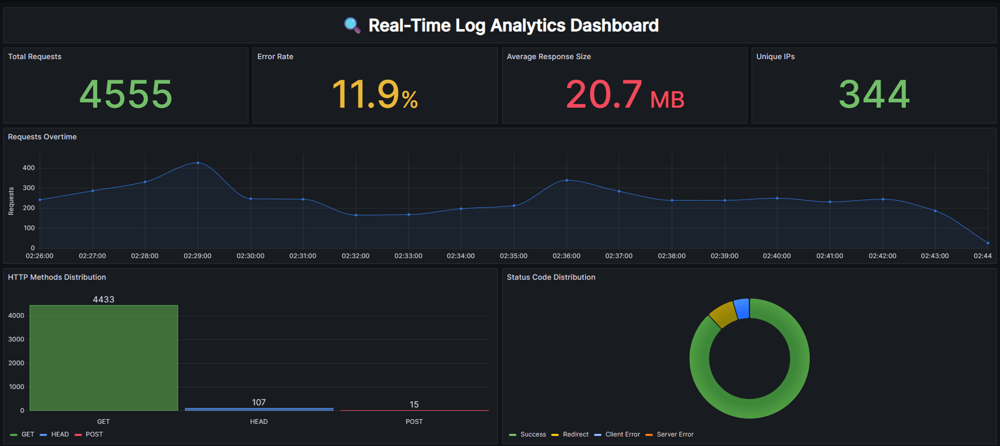

# 📡 Real-Time Log Analytics Pipeline: Powered by Kafka, Spark & HDFS

This project delivers a **streaming data engineering pipeline** that ingests raw web server logs in real time, processes and stores them in a **Bronze–Silver–Gold architecture**, and visualizes insights in Grafana.  
It combines **Apache Kafka** for real-time ingestion, **Apache Spark Structured Streaming** for transformation, and **Hadoop HDFS** plus **PostgreSQL** for persistent storage — all fully containerized with **Docker Compose**.

The pipeline is designed to be production-ready, fault-tolerant, and scalable, making it suitable for both local development and deployment in distributed environments.

---

## 🚀 Project Overview

This project processes real-time log data from a Kafka topic, applies parsing and cleaning transformations in Spark, stores results in HDFS (Bronze & Silver layers) and PostgreSQL (Gold layer), and visualizes them in Grafana.

### 🔑 Key Features
* **Real-Time Streaming:** Continuous ingestion from Kafka with millisecond latency.
* **Bronze–Silver–Gold Data Lake Architecture:**
  - **Bronze:** Raw logs in Ingested and Archived in HDFS.
  - **Silver:** Parsed and structured logs in HDFS.
  - **Gold:** Analytics-ready data in PostgreSQL for Grafana dashboards.
* **Fully Containerized:** Kafka, Zookeeper, Spark, Hadoop and Grafana orchestrated with Docker Compose.
* **Scalable & Fault-Tolerant:** Spark Structured Streaming with checkpoints for recovery.
* **Interactive Dashboards:** Live log metrics in Grafana.

---

## 🛠️ Tech Stack

| Tool                  | Role                                           |
| --------------------- | ---------------------------------------------- |
| **Apache Kafka**      | Real-time message broker for logs ingestion    |
| **Apache Zookeeper**  | Kafka cluster coordination                     |
| **Apache Spark**      | Streaming ETL and data processing              |
| **Hadoop HDFS**       | Distributed storage for Bronze & Silver layers |
| **PostgreSQL**        | Gold layer storage for analytics queries       |
| **Grafana**           | Real-time data visualization                   |
| **Docker Compose**    | Container orchestration                        |

---

## 🗺️ Architecture Diagram

A visual overview of the log analytics pipeline:


*Figure 1: High-level overview of the Logs Analysis Pipeline Architecture.*


---

## 📁 Project Structure

```plaintext
NGINX_LOGS_STREAM_ANALYTICS/
│
├── docker-compose.yml         # Defines multi-container Docker environment
├── spark/
│   └── consumer.py            # Spark Structured Streaming job
├── data/                      # Local placeholder for logs (optional)
├── grafana/                   # Grafana provisioning (datasources, dashboards)
├── images/                    # Images used for the repo (Architecture Diagram , Grafana Dashboard)
├── jars/                      # Spark connector JARs (PostgreSQL)
├── notebooks/                 # Optional exploration notebooks
└── README.md
```
---

## 📈 Grafana Dashboard


*Figure 2: High-level overview of the Logs Analysis Pipeline Architecture.*


---

## ⚙️ Getting Started

### 1️⃣ Clone the Repository

```bash
git clone https://github.com/Kareem3laa2/Nginx_logs_stream_analytics.git
cd Nginx_logs_stream_analytics
```

### 2️⃣ Start Docker Compose

```bash
docker-compose up --build
```

### 3️⃣ Produce Logs to Kafka

Run your log producer script or container that sends log lines to the Kafka topic logs.

### 4️⃣ Spark Streaming Consumer

```bash
docker exec -it stream-spark-master spark-submit --packages org.apache.spark:spark-sql-kafka-0-10_2.12:3.4.1 /opt/spark-apps/consumer.py
```

* Read logs from Kafka
* Write raw logs to HDFS **(Bronze)**
* Parse logs into structured form **(Silver)**
* Write structured data to PostgreSQL **(Gold)**

### 5️⃣ Access Services

* **Grafana UI:** http://localhost:3000/ *Username/Password:admin*
* **Kafka UI:** http://localhost:8080/